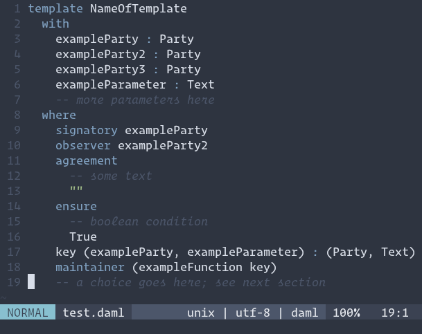

# daml.vim

Syntax highlighting for DAML, mostly by reusing the Haskell syntax highlighter.

## Example

## Acknowledgements
Mostly taken from [the daml forum](https://discuss.daml.com/t/daml-on-vim/465)
